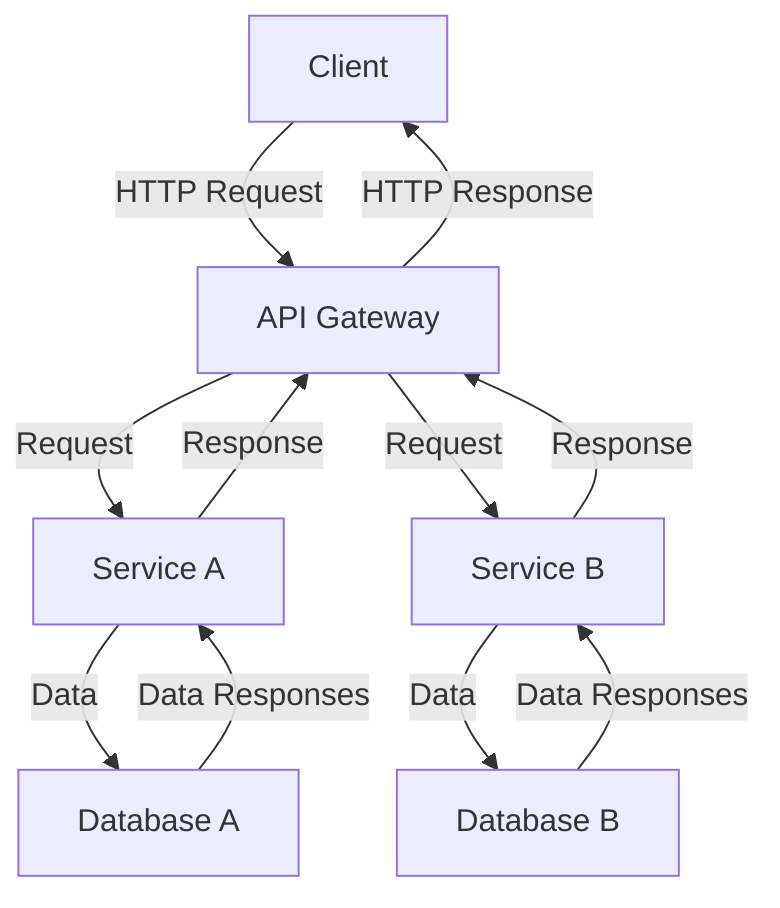

## System Architecture

### Components:
1. **Client**: The user interface through which users interact with the application.
2. **API Gateway**: Acts as a single entry point for all client requests, routing them to the appropriate services.
3. **Service A**: Handles a specific business logic or microservice.
4. **Service B**: Handles another distinct business logic or microservice.
5. **Database A**: Stores data pertinent to Service A.
6. **Database B**: Stores data pertinent to Service B. 

### Description:
- The Client sends HTTP requests to the API Gateway.
- The API Gateway routes requests to the appropriate microservices (Service A or Service B).
- Each service handles requests, interacts with its respective database and sends the data response back to the API Gateway.
- Finally, the API Gateway sends the response back to the Client.